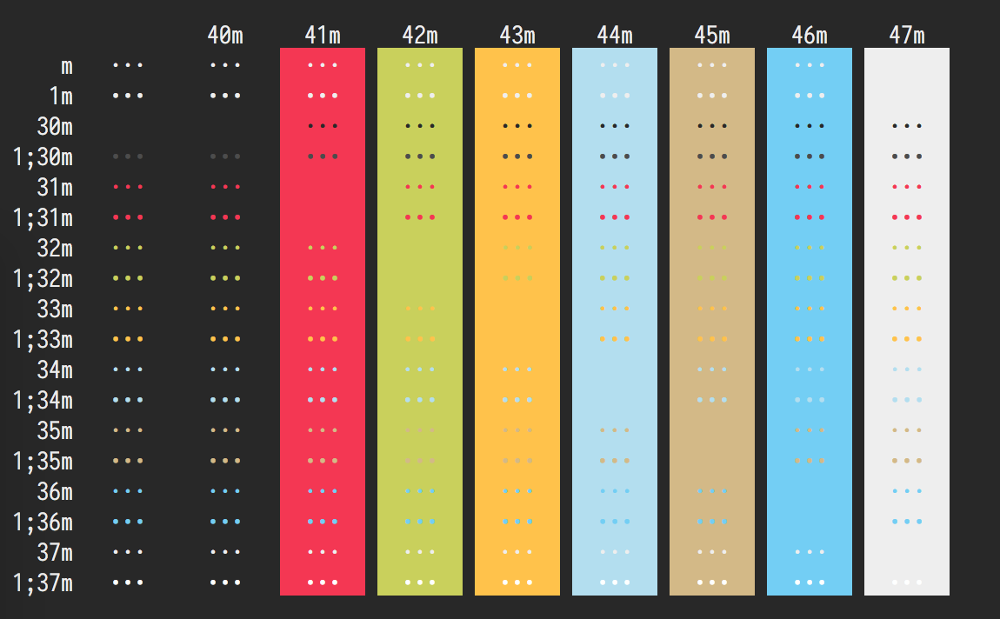
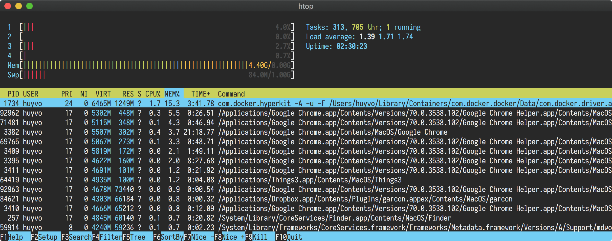
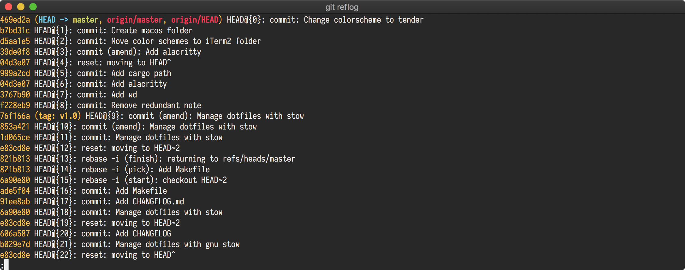

# Tender-Alacritty

An <a href='https://github.com/jwilm/alacritty'>Alacritty</a> color scheme inspired by the <a href='https://github.com/jacoborus/tender.vim'>tender_vim</a> color scheme.

## Installation

Replace the current color definitions in your [alacritty.yml](https://github.com/jwilm/alacritty#configuration) configuration file with the content from the [tender.yml](src/tender.yml) file.

## Screenshots

*Font: Iosevka 14pt*

## Contribution

Please report issues/bugs, feature requests and suggestions for improvements to the [issue tracker](https://github.com/huyvohcmc/tender-alacritty/issues).
